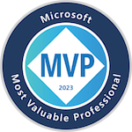

# Jeffery Hicks

## IT Pro | Teacher | Author | Speaker | Microsoft MVP

 Jeffery Hicks is an IT veteran with almost 35 years of experience, much of it spent as an IT infrastructure consultant specializing in Microsoft server technologies with an emphasis on automation and efficiency. He is a multi-year recipient of the Microsoft MVP Award. Jeff is a respected and well-known author, teacher, and consultant. Jeff has taught and presented PowerShell content and the benefits of automation to IT Pros worldwide for the last 20 years. He has authored, co-authored, and edited several books, contributed to numerous online sites, and, back when it was still a thing, several print publications. Jeff is a Pluralsight author and a frequent speaker at technology conferences and user groups.

Unfortunately, Jeff doesn't have the resources to provide one-on-one training, but if he can be of assistance to your organization, you are welcome to [contact him](mailto:jhicks@jdhitsolutions.com?Subject=Hello) by email.

### Recent Appearances

If you are interested in having me appear or present at your event, please read [my speaker requirements](https://jdhitsolutions.com/blog/conferences/9327/my-conference-future/).

#### [Twin Cities Systems Management User Group](https://tcsmug.org/)

- [PowerShell Scripting and Toolmaking](https://github.com/jdhitsolutions/PSScriptingToolmaking)
- *This presentation was not recorded*.

#### [Research Triangle PowerShell User Group](https://www.meetup.com/Research-Triangle-PowerShell-Users-Group/)

- Writing Better PowerShell Code
  - [Session material and code samples](https://gist.github.com/jdhitsolutions/a2f3a246c929a91e494601fa1c44fa55)
  - View the presentation on [YouTube](https://www.youtube.com/watch?v=WxoO1KJqCxU)

#### PSUG Rhein Neckar

- PSStyle and PowerShell
  - [Code samples](https://github.com/jdhitsolutions/PowerShell-with-Style)
  - View the recording on [YouTube](https://www.youtube.com/watch?v=6LySy7rrUO8).

#### The PowerShell Podcast

- [Episode 107 Crafting a Fulfilling Career](https://www.youtube.com/watch?v=5kPqaXb6JjE)

#### PowerShell UserGroup Inn-Salzach

- [PowerShell Pet Projects](https://www.youtube.com/watch?v=9vqTDF3u5l8&t=1s)

#### Live 360/Techmentor Orlando 2023

- [Managing Active Directory with PowerShell](https://github.com/jdhitsolutions/Techmentor2023-ManagingAD)
- [Finding Needles - Better EventLog Management with PowerShell](https://github.com/jdhitsolutions/Techmentor2023-EventLogMgmt)
- [PowerShell Hands-On Workshop](https://github.com/jdhitsolutions/Techmentor2023-PowerShellHOL)

#### [MMS Miami 2023](https://github.com/jdhitsolutions/MMSMiami-2023)

- [Managing at Scale](https://github.com/jdhitsolutions/MMSMiami-2023/tree/main/ManagingAtScale)
- [PowerShell Toolmaking Patterns and Practices](https://github.com/jdhitsolutions/MMSMiami-2023/tree/main/PSToolMakingPatterns)

### Professional Links

- [LinkedIn](https://www.linkedin.com/in/jefferyhicks/)
- [Microsoft MVP](https://mvp.microsoft.com/en-us/PublicProfile/4000314)
- [DevOps Collective Board of Advisors](https://devopscollective.org/about/)

### Social Links

- [X](https://twitter.com/jeffhicks)
- <a rel="me" href="https://techhub.social/@JeffHicks">Mastodon</a>
- [BlueSky](https://bsky.app/profile/jeffhicks.bsky.social)

### Online Content

- [Premium newsletter](https://buttondown.email/behind-the-powershell-pipeline)
- [Blog](https://jdhitsolutions.com/blog)
- [Petri](https://petri.com/author/jeff-hicks/)
- [4Sysops](https://4sysops.com/members/jeffery-hicks/)
- [YouTube](https://www.youtube.com/channel/UC-UCPvmrflWlgHUuT16hr3w)

### GitHub

- [Projects](https://github.com/jdhitsolutions)
- [Gists](https://gist.github.com/jdhitsolutions)

I am also a member of the [PowerShell Cmdlets](https://github.com/PowerShell/PowerShell/blob/master/docs/community/working-group-definitions.md#cmdlets-and-modules) working group.

### Books

- [The PowerShell Practice Primer](https://leanpub.com/psprimer)
- [PowerShell Scripting and Toolmaking](https://leanpub.com/powershell-scripting-toolmaking/)
- [Learn PowerShell in a Month of Lunches 4th Ed.](https://www.manning.com/books/learn-powershell-in-a-month-of-lunches?a_aid=jdhit&chan=code1)
- [Learn PowerShell Scripting in a Month of Lunches 2nd. Ed.](https://www.manning.com/books/learn-powershell-scripting-in-a-month-of-lunches-second-edition?a_aid=jdhit&chan=code1&a_aid=jdhit&chan=code1)
- [#PS7Now](https://leanpub.com/ps7now)
- [The PowerShell Conference Book](https://leanpub.com/powershell-conference-book)
- [PowerShell in Depth](https://www.manning.com/books/powershell-in-depth-second-edition)

### Courseware

- [Pluralsight](https://pluralsight.pxf.io/qbR6n)

### Other

I am an amateur composer in my free time.

- [MuseScore](https://musescore.com/user/26698536)
- [My YouTube music channel](https://www.youtube.com/channel/UCQgbzJeDQm3zvuHz13UMwZA)
- [SoundCloud](https://soundcloud.com/jhicks61)

  
