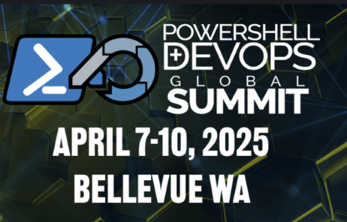

# Jeffery Hicks

## IT Pro | Teacher | Author | Speaker | Microsoft MVP

Jeffery Hicks is an IT Pro veteran with 35 years of experience, much of it spent as an IT infrastructure professional specializing in Microsoft server technologies with an emphasis on automation and efficiency. He has been a Microsoft MVP since 2007 for his work in PowerShell.

Jeff is a respected and well-known author, teacher, and consultant. He has taught or presented PowerShell content and the benefits of automation to IT Pros worldwide since its inception. He has authored, co-authored, and edited several books, contributed to numerous online sites, and, back when it was still a thing, several print publications. Jeff is a Pluralsight author and a frequent speaker at technology conferences and user groups.

Unfortunately, Jeff doesn't have the resources to provide one-on-one training, but if he can be of assistance to your organization, you are welcome to [contact him](mailto:jhicks@jdhitsolutions.com?Subject=Hello) by email. Jeff's onsite classes are hands-on and customized to meet the client's needs.

### Upcoming Events

- The Human Side of PowerShell Scripting

- Building Better PowerShell Reports
- Building Better PowerShell Tools

- The Human Side of PowerShell Scripting
- Supercharging Objects in the Pipeline

### Recent Public Appearances and Presentations

If I have spoken at a conference that you run, or you would like me to present at a future event, please read my [Public Presentation Policy](https://gist.github.com/jdhitsolutions/d0f1eeae99878a10f8132a44747db47a).

#### [RunAs Radio Show #977](https://runasradio.com/Shows/Show/977)

- Writing Better PowerShell (26 March 2025)

#### [Research Triangle PowerShell User Group](https://www.meetup.com/Research-Triangle-PowerShell-Users-Group/)

- Getting Started with Custom Formatting (5 March 2025)
  - [Session material and Code Samples](https://github.com/jdhitsolutions/PSCustomFormatting)
  - Video recording coming soon.
- Writing Better PowerShell Code (23 April 2024)
  - [Session material and code samples](https://gist.github.com/jdhitsolutions/a2f3a246c929a91e494601fa1c44fa55)
  - View the presentation on [YouTube](https://www.youtube.com/watch?v=WxoO1KJqCxU)

#### [Pacific PowerShell User Group](https://www.meetup.com/pacific-powershell-user-group/)

- [Reaching for the Bluesky](https://www.meetup.com/pacific-powershell-user-group/events/305394632/?eventOrigin=group_past_events) (15 Jan 2025)
  - video unavailable

#### [Twin Cities Systems Management User Group](https://tcsmug.org/)

- [PowerShell Scripting and Toolmaking](https://github.com/jdhitsolutions/PSScriptingToolmaking) (15 April 2024)
- *This presentation was not recorded*.

#### PSUG Rhein Neckar

- PSStyle and PowerShell (13 March 2024)
  - [Code samples](https://github.com/jdhitsolutions/PowerShell-with-Style)
  - View the recording on [YouTube](https://www.youtube.com/watch?v=6LySy7rrUO8).

#### The PowerShell Podcast

- [Episode 107 Crafting a Fulfilling Career](https://www.youtube.com/watch?v=5kPqaXb6JjE)

#### PowerShell UserGroup Inn-Salzach

- [PowerShell Pet Projects](https://www.youtube.com/watch?v=9vqTDF3u5l8&t=1s)

#### Live 360/Techmentor Orlando 2023

- [Managing Active Directory with PowerShell](https://github.com/jdhitsolutions/Techmentor2023-ManagingAD)
- [Finding Needles - Better EventLog Management with PowerShell](https://github.com/jdhitsolutions/Techmentor2023-EventLogMgmt)
- [PowerShell Hands-On Workshop](https://github.com/jdhitsolutions/Techmentor2023-PowerShellHOL)

#### [MMS Miami 2023](https://github.com/jdhitsolutions/MMSMiami-2023)

- [Managing at Scale](https://github.com/jdhitsolutions/MMSMiami-2023/tree/main/ManagingAtScale)
- [PowerShell Toolmaking Patterns and Practices](https://github.com/jdhitsolutions/MMSMiami-2023/tree/main/PSToolMakingPatterns)

### Professional Links

- [LinkedIn](https://www.linkedin.com/in/jefferyhicks/)
- [Microsoft MVP](https://mvp.microsoft.com/en-us/PublicProfile/4000314)
- [DevOps Collective Board of Advisors](https://devopscollective.org/about/)
- [Sessionize](https://sessionize.com/jeff-hicks)

### Social Links

My [X/Twitter](https://x.com/jeffhicks) account is inactive and in read-only mode. I am not actively monitoring or responding to messages on this platform. For engagement, please use either [BlueSky](https://bsky.app/profile/jdhitsolutions.com) or <a rel="me" href="https://techhub.social/@JeffHicks">Mastodon</a>

### Online Content

- [Premium newsletter - Behind the PowerShell Pipeline](https://jdhitsolutions.com/newsletter)

#### Recent Articles

- [Mastering Changelog Management with PowerShell](https://www.scriptrunner.com/en/blog/what-is-a-changelog-and-how-to-manage-it)
- [How to Use Winget and PowerShell for Efficient App Deployment](https://www.scriptrunner.com/en/blog/master-managing-winget-powershell)
- [Five Reasons You Should Be Using PSReadLine](https://www.scriptrunner.com/en/blog/5-reasons-to-use-psreadline)

#### Older Online Material

- [Blog](https://jdhitsolutions.com/blog)
- [Petri.com](https://petri.com/author/jeff-hicks/)
- [4Sysops.com](https://4sysops.com/members/jeffery-hicks/)
- [YouTube](https://www.youtube.com/channel/UC-UCPvmrflWlgHUuT16hr3w)

### GitHub

- [Projects](https://github.com/jdhitsolutions)
- [Gists](https://gist.github.com/jdhitsolutions)

I am also a member of the [PowerShell Cmdlets](https://github.com/PowerShell/PowerShell/blob/master/docs/community/working-group-definitions.md#cmdlets-and-modules) working group.

### Books

- [Behind the PowerShell Pipeline](https://jdhitsolutions.com/yourls/psbehind)
- [The PowerShell Practice Primer](https://jdhitsolutions.com/yourls/psprimer)
- [PowerShell Scripting and Toolmaking](https://jdhitsolutions.com/yourls/pstoolmaking)
- [Learn PowerShell in a Month of Lunches 4th Ed.](https://www.manning.com/books/learn-powershell-in-a-month-of-lunches?a_aid=jdhit&chan=code1)
- [Learn PowerShell Scripting in a Month of Lunches 2nd. Ed.](https://www.manning.com/books/learn-powershell-scripting-in-a-month-of-lunches-second-edition?a_aid=jdhit&chan=code1&a_aid=jdhit&chan=code1)
- [#PS7Now](https://leanpub.com/ps7now)
- [The PowerShell Conference Book](https://leanpub.com/powershell-conference-book)
- [PowerShell in Depth](https://www.manning.com/books/powershell-in-depth-second-edition)

### Courseware

- [Pluralsight](https://pluralsight.pxf.io/qbR6n)

### Other

In my free time, I dabble at composing music.

- [MuseScore](https://musescore.com/user/26698536)
- [My YouTube music channel](https://www.youtube.com/channel/UCQgbzJeDQm3zvuHz13UMwZA)
- [SoundCloud](https://soundcloud.com/jhicks61)

  
