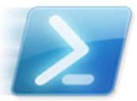

# Jeffery Hicks

## IT Pro | Teacher | Author | Speaker | Microsoft MVP

Jeffery Hicks is an IT Pro veteran with 35 years of experience, much of it spent as an IT infrastructure professional specializing in Microsoft server technologies with an emphasis on automation and efficiency. He has been a Microsoft MVP since 2007 for his work in PowerShell.

Jeff is a respected and well-known author, teacher, and consultant. He has taught or presented PowerShell content and the benefits of automation to IT Pros worldwide since its inception. He has authored, co-authored, and edited several books, contributed to numerous online sites, and, back when it was still a thing, several print publications. Jeff is a Pluralsight author and a frequent speaker at technology conferences and user groups.

Unfortunately, Jeff doesn't have the resources to provide one-on-one training, but if he can be of assistance to your organization, you are welcome to [contact him](mailto:jhicks@jdhitsolutions.com?Subject=Hello) by email. Jeff's onsite classes are hands-on and customized to meet the client's needs.

### Upcoming Events

- [PowerShell + DevOps Global Summit 2026 - Bellevue, WA](https://powershellsummit.org) (April 13-16 2026)
  - Master PowerShell Parameters

- [PSConfEU 2026 - Wiesbaden, Germany](https://psconf.eu) (June 1-4 2026)
  - PowerShell Scripting Hidden Secrets
  - Embracing Events in PowerShell

*Let's connect and see what I can do for you!*

### Recent Public Appearances and Presentations

If I have spoken at a conference that you run, or you would like me to present at a future event, please read my [Public Presentation Policy](https://gist.github.com/jdhitsolutions/d0f1eeae99878a10f8132a44747db47a).

#### [PSConfEU MiniCon 2025](https://www.youtube.com/playlist?list=PLDCEho7foSorZKs9Vc7XKU7Dn5jwK2O2L) (14 October 2025)

- [The Human Side of PowerShell Scripting](https://youtu.be/59PQ9qB4ilo)

#### PDQ Live Finale (18 December 2025)

- [PowerShell Hour](https://www.youtube.com/live/cPhHR_Cdwsk?si=8nIqfgEA9dbC_cMC&t=5650)

#### PowerShell Wednesday

- [PowerShell Daily Workflow Tools](https://www.youtube.com/watch?v=lBLDfE1aiuE&list=PL1mL90yFExsix-L0havb8SbZXoYRPol0B&index=4) (3 December 2025 )

#### [PowerShell Podcast](https://powershellpodcast.podbean.com)

- [Living in PowerShell](https://powershellpodcast.podbean.com/e/living-in-powershell-with-jeff-hicks/) (22 Dec 2025)
  - Watch on [YouTube](https://www.youtube.com/watch?v=lKKfmdDtBOU)

#### [PSConfEU MiniCon 2025](https://synedgy.com/psconfeu-minicon/)

- The Human Side of PowerShell Scripting (14 October 2025)
  - Watch the presentation on [YouTube](https://www.youtube.com/watch?v=59PQ9qB4ilo)

#### [PowerShell + DevOps Global Summit 2025](https://powershellsummit.org)

- The Human Side of PowerShell Scripting (9 April 2025)
  - Watch the presentation on [YouTube](https://www.youtube.com/watch?v=4xVDorpEhm8&list=PLfeA8kIs7CoftB7JKZTiUKnVUHIMtwYF5&index=24)

#### [RunAs Radio Show #977](https://runasradio.com/Shows/Show/977)

- Writing Better PowerShell (26 March 2025)

#### [Research Triangle PowerShell User Group](https://www.meetup.com/Research-Triangle-PowerShell-Users-Group/)

- Getting Started with Custom Formatting (5 March 2025)
  - [Session material and Code Samples](https://github.com/jdhitsolutions/PSCustomFormatting)
  - View the presentation on [YouTube](https://youtu.be/9CTJNHXJzwU?si=PLlI5S9B3rqwg7hf)
- Writing Better PowerShell Code (23 April 2024)
  - [Session material and code samples](https://gist.github.com/jdhitsolutions/a2f3a246c929a91e494601fa1c44fa55)
  - View the presentation on [YouTube](https://www.youtube.com/watch?v=WxoO1KJqCxU)

#### [Pacific PowerShell User Group](https://www.meetup.com/pacific-powershell-user-group/)

- [Reaching for the Bluesky](https://www.meetup.com/pacific-powershell-user-group/events/305394632/?eventOrigin=group_past_events) (15 Jan 2025)
  - video unavailable

### Professional Links

- [LinkedIn](https://www.linkedin.com/in/jefferyhicks/)
- [Microsoft MVP](https://mvp.microsoft.com/en-us/PublicProfile/4000314)
- [DevOps Collective Board of Advisors](https://devopscollective.org/about/)
- [Sessionize](https://sessionize.com/jeff-hicks)

### Social Links

My [X/Twitter](https://x.com/jeffhicks) account is inactive and in read-only mode. I am not actively monitoring or responding to messages on this platform. For engagement, please use either [BlueSky](https://bsky.app/profile/jdhitsolutions.com) or <a rel="me" href="https://techhub.social/@JeffHicks">Mastodon</a>

### Online Content

- [Premium PowerShell Tutorials - Behind the PowerShell Pipeline](https://jdhitsolutions.com/newsletter)

#### OnlineArticles

- [Mastering Changelog Management with PowerShell](https://www.scriptrunner.com/en/blog/what-is-a-changelog-and-how-to-manage-it)
- [How to Use Winget and PowerShell for Efficient App Deployment](https://www.scriptrunner.com/en/blog/master-managing-winget-powershell)
- [Five Reasons You Should Be Using PSReadLine](https://www.scriptrunner.com/en/blog/5-reasons-to-use-psreadline)

#### Older Online Material

- [Blog](https://jdhitsolutions.com/blog)
- [Petri.com](https://petri.com/author/jeff-hicks/)
- [4Sysops.com](https://4sysops.com/members/jeffery-hicks/)
- [YouTube](https://www.youtube.com/channel/UC-UCPvmrflWlgHUuT16hr3w)

### GitHub

- [Projects](https://github.com/jdhitsolutions)
- [Gists](https://gist.github.com/jdhitsolutions)

I am also a member of the [PowerShell Cmdlets](https://github.com/PowerShell/PowerShell/blob/master/docs/community/working-group-definitions.md#cmdlets-and-modules) working group.

### Books

Books published on Leanpub often include a supplemental download with code samples.

- [Behind the PowerShell Pipeline](https://jdhitsolutions.com/yourls/psbehind)
- [The PowerShell Practice Primer](https://jdhitsolutions.com/yourls/psprimer)
- [PowerShell Scripting and Toolmaking](https://jdhitsolutions.com/yourls/pstoolmaking)
- [Learn PowerShell in a Month of Lunches 4th Ed.](https://www.manning.com/books/learn-powershell-in-a-month-of-lunches?a_aid=jdhit&chan=code1)
- [Learn PowerShell Scripting in a Month of Lunches 2nd. Ed.](https://www.manning.com/books/learn-powershell-scripting-in-a-month-of-lunches-second-edition?a_aid=jdhit&chan=code1&a_aid=jdhit&chan=code1)
- [#PS7Now](https://leanpub.com/ps7now)
- [The PowerShell Conference Book](https://leanpub.com/powershell-conference-book)
- [PowerShell in Depth](https://www.manning.com/books/powershell-in-depth-second-edition)

### Courseware

- [Pluralsight](https://pluralsight.pxf.io/qbR6n)

### Other

In my free time, I dabble at composing music.

- [MuseScore](https://musescore.com/user/26698536)
- [My YouTube music channel](https://www.youtube.com/channel/UCQgbzJeDQm3zvuHz13UMwZA)
- [SoundCloud](https://soundcloud.com/jhicks61)

  
